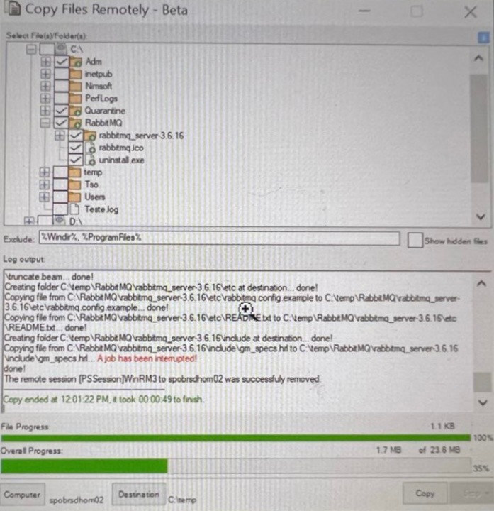
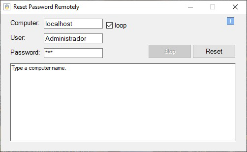

# PowerShell Scripts Portfolio

Welcome to my Powershell scripts Portifolio! Below a collection of scripts that I created for many different tasks, I will regularly upload more codes.

Created: 13/Feb/2025

Last Update: 14/Feb/2025

## Scripts List

### Script 1: Copy Files Remotely Beta (2019)
This script allows the user using a GUI to copy files from a remote computer respecting the remote directory three.
At the time I was studying threads in order to have a better grasp of the concept.

**Script's Path:** [Scripts/Copy_Files_Remotely_Beta.ps1](Scripts/Copy_Files_Remotely_Beta.ps1)

### Script 2: Reset Password Remotely (2019)
After learning a bit about the concept of threads I started developing small other pieces of code to help the IT staff.
This one allows you to reset an user local account password in a remote computer.

**Script's Path:** [Scripts/Reset_Password_Remotely.ps1](Scripts/Reset_Password_Remotely.ps1)

### Script 3: Coming soon
