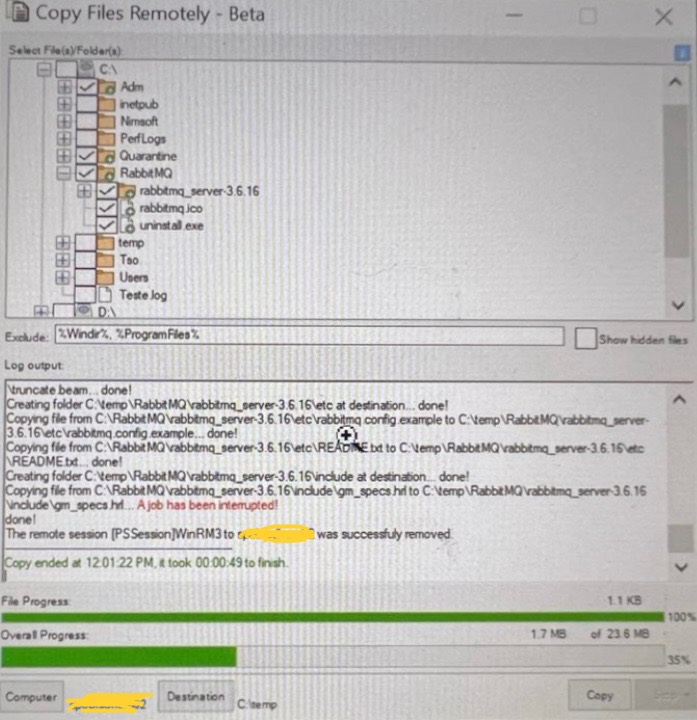

# PowerShell Scripts Portfolio

Welcome to my Powershell scripts Portifolio! Below a collection of scripts that I created for many different tasks, I will regularly upload more codes.  
[My LinkedIn Profile](https://linkedin.com/in/angelo-polatto)

Created: 13/Feb/2025  
Last Update: 26/Feb/2025

## Scripts List

### Script 1: # Copy Files Remotely – PowerShell GUI Tool (2019)

## Overview  
This project is a PowerShell-based GUI application designed to facilitate **remote file browsing and transfer**. It was developed as a study case to explore the capabilities of **PowerShell remoting, multi-threading, and GUI design**. The script provides an interactive interface for copying files from remote systems while maintaining responsiveness and efficiency.  

## Key Features  
- **Graphical User Interface (GUI):** Built using Windows Forms for an intuitive user experience.  
- **Remote File System Browsing:** Dynamically assembles and displays remote directory structures.  
- **Optimized Remote File Copying:** Transfers files in controlled chunks to ensure reliability.  
- **Multi-Threading with Runspaces:** Keeps the UI responsive while handling operations in the background.  
- **Progress Tracking & Logging:** Provides real-time feedback and logs operations for auditing.  

## Technical Highlights  
This project incorporates several advanced PowerShell techniques:  

### 1. Remote File Copying with Chunked Transfers  
Rather than using a simple `Copy-Item` approach, this script implements a method to **split large files into smaller parts** (4096-byte chunks) during remote transfers. This helps ensure stability over network connections and allows **fine-grained progress tracking**.  

### 2. Dynamic Remote Tree Assembly  
The script includes a **custom recursive method to query remote file systems**, assembling the directory structure dynamically. This process:  
- Uses **PowerShell remoting (`New-PSSession`)** to execute queries efficiently.  
- Leverages **runspaces** for parallel execution, improving performance.  
- Implements **custom logic to filter system and hidden files** when needed.  

### 3. Multi-Threading for Performance & UI Responsiveness  
Unlike conventional PowerShell scripts that can become unresponsive during execution, this project utilizes **runspaces** to process tasks asynchronously. This allows:  
- The GUI to remain interactive while background operations run.  
- Multiple tasks to execute in parallel without blocking user input.  
- Improved efficiency when handling large datasets.  

### 4. Robust Error Handling & Logging  
- Operations are logged in real-time within the application.  
- The script can write entries to the **Windows Event Log**, making it useful for enterprise environments.  
- Detailed error handling ensures graceful recovery from failures.  

## Project Intent & Learning Outcomes  
This project was developed as a **study case to explore the limits of PowerShell scripting**. It demonstrates:  
- **A structured approach to building complex PowerShell applications.**  
- **Best practices in GUI development and user interaction within PowerShell.**  
- **A deeper understanding of PowerShell remoting, session management, and concurrency.**  

While this is a personal learning project, the methods used here could be valuable in real-world automation scenarios, particularly in **enterprise IT environments requiring remote file management solutions**.  

## Final Thoughts  
This project represents an exploration of **what is possible with PowerShell beyond traditional scripting**. The focus was on **building a functional, efficient, and user-friendly tool**, while also learning about **PowerShell’s strengths and limitations in GUI development, remoting, and parallel execution**.  

Any feedback or suggestions for improvement are always welcome!  




**Script's Path:** [Scripts/Copy_Files_Remotely_Beta.ps1](Scripts/Copy_Files_Remotely_Beta.ps1)

### Script 2: # Reset Password Remotely – PowerShell GUI Tool (2019)

## Overview  
This PowerShell script is a GUI-based application designed to reset the password of a local user account on a remote computer. The tool leverages Windows Forms for its interface and utilizes Active Directory to populate a list of target computers. It was created as a study case to master advanced PowerShell techniques—such as remoting, asynchronous execution with runspaces, and robust error handling—while providing a practical solution for remote password management.

## Key Features  
- **Graphical User Interface (GUI):**  
  Built using Windows Forms, the application offers an intuitive interface for entering the computer name, username, and new password.

- **Remote Password Reset:**  
  Resets a local account’s password on a remote computer by establishing a PowerShell remoting session.

- **Adaptive Password Change Method:**  
  The script intelligently selects the appropriate method based on the system environment:
  - For systems with PowerShell version >2 and OS builds >16070, it uses `Get-LocalUser` and `Set-LocalUser`.
  - For older environments, it falls back on WMI and ADSI approaches.

- **Connectivity Testing:**  
  Implements checks using `Test-Connection` and `Test-WSMan` to verify remote connectivity and ensure that WinRM is active before proceeding.

- **Asynchronous Execution with Runspaces:**  
  Utilizes runspaces to run remote commands asynchronously, keeping the user interface responsive even during long-running operations.

- **Looping Option:**  
  Provides an option to repeat the password reset attempt automatically until a successful connection is established, enhancing robustness in intermittent network conditions.

## Technical Highlights  
- **PowerShell Remoting:**  
  Establishes secure remote sessions using `New-PSSession` and executes commands remotely via `Invoke-Command`.

- **Dynamic Runspace Management:**  
  Uses runspaces to handle tasks asynchronously, ensuring the GUI remains interactive during background processing.

- **Robust Error Handling & Logging:**  
  Detailed error checking and logging mechanisms provide clear feedback within the GUI if issues occur during connectivity or the password reset process.

- **Legacy and Environment Support:**  
  Designed to support PowerShell 3.0 and earlier versions, the script is adaptable for various environments—particularly domain-joined computers where the executing user has the necessary permissions.

## Usage Instructions  
1. **Prerequisites:**  
   - The current user must have permission to reset local account passwords on the remote computer.
   - The target computer should be domain-joined and accessible over the network.
   - WinRM must be enabled on the remote system.

2. **Execution:**  
   - Open PowerShell ISE or a PowerShell prompt.
   - Run the script (`ResetPasswordRemotely.ps1`).
   - Enter the remote computer name, username, and desired new password into the provided fields.
   - Click the **Reset** button to initiate the password reset process.
   - Monitor progress and log output in the GUI. The **Stop** button is available to interrupt the process if necessary.

3. **Customization:**  
   - Modify the computer filter (around line 216) to adjust the list of computers that populates the dropdown, based on your environment.

## Final Thoughts  
This project represents a personal study case aimed at exploring and mastering advanced PowerShell scripting techniques, including GUI development, remoting, and asynchronous task handling. While it offers a functional solution for remotely resetting local user passwords, it also serves as an example of structured, robust, and adaptable PowerShell programming. Feedback and suggestions for further improvements are welcome.

---

Thank you for reviewing this project.


**Script's Path:** [Scripts/Reset_Password_Remotely.ps1](Scripts/Reset_Password_Remotely.ps1)

### Script 3: # List Users Information in Active Directory – PowerShell GUI Tool (2019)

## Overview

This PowerShell script provides a **GUI-based application** to retrieve and display user information from **Active Directory (AD)**. The tool allows administrators to **search for users, view detailed attributes, and export results**, all within an intuitive Windows Forms interface.

This project was developed as a **study case** to explore and master:
- **PowerShell GUI development**
- **Active Directory automation**
- **Advanced scripting techniques**
- **Error handling and logging**

## Key Features

- **Graphical User Interface (GUI):**  
  Built using **Windows Forms**, the application offers an intuitive interface for searching and managing AD user data.
  
- **Active Directory User Search:**  
  Allows searching for users based on **username, email, or display name**.

- **Detailed User Information Display:**  
  Retrieves and displays **group memberships, account status, and last logon details**.

- **Export Functionality:**  
  Enables **exporting search results to CSV** for reporting and auditing purposes.

- **Error Handling and Logging:**  
  Implements **robust error handling** with logging to assist in troubleshooting.

## Technical Highlights

This project incorporates several advanced PowerShell techniques:

### 1️⃣ Active Directory Integration
- Uses `Get-ADUser` to retrieve **user information dynamically**.
- Supports **filters and search bases** to optimize performance.

### 2️⃣ GUI Development with Windows Forms
- Builds an **interactive UI** using PowerShell’s **Windows Forms**.
- Includes **text boxes, buttons, and data grids** for user-friendly interaction.

### 3️⃣ Export Functionality
- Implements `Export-Csv` to allow users to save search results for **further analysis or record-keeping**.

### 4️⃣ Error Handling and Logging
- Uses **Try-Catch blocks** to gracefully manage exceptions.
- Logs **errors and important events** for debugging and monitoring.

## Usage Instructions

### Prerequisites
- The executing user must have **permissions** to read user information from Active Directory.
- The **Active Directory module** must be installed on the system running the script.

### Execution
1. **Open PowerShell with administrative privileges.**
2. **Run the script:**
   ```powershell
   .\ListADUsers.ps1
  ## Instructions
## Instructions

- Enter search criteria (username, email, or display name).
- Click the **"Search"** button to retrieve matching users.
- Select a user from the results to view detailed information.
- Click **"Export to CSV"** to save results.

## Final Thoughts

This project demonstrates my work with advanced PowerShell scripting for Active Directory automation, GUI development, and error handling.

I welcome any feedback or suggestions for further enhancements.


**Script's Path:** [Scripts/GetAdUserInfo.ps1](Scripts/GetAdUserInfo.ps1)

### Script 4: Coming soon
